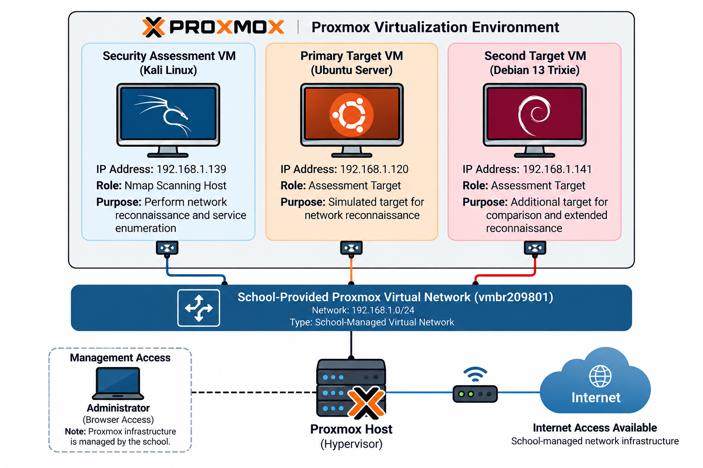

# Nmap Network Reconnaissance & Service Exposure Assessment

> **Authorized Proxmox-Based Cybersecurity Laboratory**

This project documents an authorized network reconnaissance and service exposure assessment conducted within a controlled, school-provided Proxmox laboratory environment.

The assessment uses **Nmap** from a Kali Linux assessment VM to perform host discovery, service/version enumeration, OS fingerprinting, security-focused service exposure analysis, and network-level service validation using cURL.

## Project Objectives

1. Perform authorized host discovery against assigned laboratory targets.
2. Identify exposed network services using Nmap.
3. Determine service and software versions where detectable.
4. Perform OS fingerprinting and document its limitations.
5. Validate identified services using appropriate network-level checks.
6. Compare the network service exposure of two Linux-based targets.
7. Document findings and recommendations based only on validated evidence.
8. Maintain an organized evidence trail suitable for cybersecurity portfolio documentation.

## Lab Environment

| System | Role | IP Address |
|---|---|---|
| Kali Linux | Nmap assessment host | `192.168.1.139` |
| Ubuntu Server | Primary assessment target | `192.168.1.120` |
| Debian 13 Trixie | Secondary assessment target | `192.168.1.141` |

### Network

- Assigned virtual network: `192.168.1.0/24`
- Proxmox virtual network: `vmbr209801`
- Internet access: Available through the school-managed network infrastructure
- Network infrastructure: School-provided and school-managed
- Shared infrastructure modified by this project: None

> **Scope boundary:** Scanning was limited to the specifically authorized laboratory targets. The broader shared network was not intentionally scanned.



## Assessment Methodology

### 1. Host Discovery

```bash
nmap -sn 192.168.1.120
nmap -sn 192.168.1.141
```

### 2. Service & Version Enumeration

```bash
nmap -sV -p 8000 192.168.1.120
nmap -sV 192.168.1.141
```

### 3. OS Fingerprinting

```bash
sudo nmap -O 192.168.1.120
sudo nmap -O 192.168.1.141
```

### 4. Service Validation

```bash
curl -I http://192.168.1.120:8000
```

The service returned `HTTP/1.0 200 OK`, confirming that the detected HTTP service was actively responding.

### 5. Findings Analysis

Results were interpreted using an evidence-based approach. An open port or exposed service was not automatically classified as a vulnerability.

### 6. Comparative Assessment

The Ubuntu and Debian targets were compared to identify differences in network-facing service exposure.

## Results

| Target | Port | Service | Detected Version | Assessment |
|---|---:|---|---|---|
| Ubuntu Server | `8000/tcp` | HTTP | SimpleHTTPServer 0.6 / Python 3.12.3 | Intentionally enabled temporary lab service |
| Debian 13 Trixie | `22/tcp` | SSH | OpenSSH 10.0p2 Debian 7+deb13u4 | Network-accessible administrative service |

### OS Detection

Nmap did not produce an exact operating system match for either target. This was treated as **inconclusive**, rather than definitive OS identification.

## Findings

### F-01 — Temporary HTTP Service Exposure on TCP/8000

**Target:** Ubuntu Server (`192.168.1.120`)

Nmap identified TCP/8000 as an open HTTP service running SimpleHTTPServer 0.6 on Python 3.12.3. cURL validation returned HTTP 200 OK.

The service was intentionally enabled within the laboratory for assessment purposes. The observation therefore demonstrates service exposure and increased network attack surface, but does **not by itself establish a vulnerability or exploitability**.

**Recommendation:** Disable the temporary HTTP service after testing and verify that TCP/8000 is no longer exposed.

### Target 2 — SSH Service Exposure on TCP/22

**Target:** Debian 13 Trixie (`192.168.1.141`)

Nmap identified TCP/22 as an SSH service running OpenSSH 10.0p2 Debian 7+deb13u4.

SSH represents a network-accessible administrative service and contributes to the target's exposed service surface. The scan alone does not establish that the service is vulnerable.

**Recommendation:** Confirm whether SSH is required for the intended laboratory configuration and restrict network access to required services where applicable.

## Evidence Structure

```text
evidence/
├── 01-proxmox-target-vm/
├── 02-security-vm/
├── 03-connectivity/
├── 04-network-boundary/
├── 05-host-discovery/
├── 06-service-enumeration/
├── 07-os-identification/
├── 08-service-validation/
├── 09-second-target/
├── 10-target2-host-discovery/
├── 11-target2-service-enumeration/
└── 12-target2-os-identification/
```

## Repository Structure

```text
Nmap-Network-Reconnaissance-Lab/
├── README.md
├── documentation/
├── evidence/
├── results/
└── diagrams/
    └── lab-architecture.png
```

## Tools & Technologies

- **Nmap 7.95**
- **Kali Linux**
- **Proxmox VE**
- **Ubuntu Server**
- **Debian 13 Trixie**
- **cURL**
- **Python SimpleHTTPServer**
- **OpenSSH**

## Limitations

This assessment did not include exploitation, credential attacks, password cracking, unauthorized access attempts, external-system scanning, scanning of unrelated systems in the shared environment, full vulnerability assessment, or production network testing.

OS fingerprinting was inconclusive for both targets.

## Security & Authorization Boundary

All activities documented in this repository were performed in an authorized and controlled laboratory environment created for cybersecurity learning and portfolio development.

The Nmap assessments were limited to intentionally configured virtual machines within the laboratory scope. Findings are based on documented observations and are not presented as evidence of compromise or vulnerabilities in any external or production system.

## Conclusion

This project demonstrates a structured approach to authorized network reconnaissance and service exposure assessment using Nmap within a controlled Proxmox environment.

The assessment identified reachable hosts, exposed services, service versions, and differences in network-facing services between two Linux targets. It also demonstrated the importance of validating automated scan results, documenting limitations, and distinguishing observable service exposure from confirmed vulnerabilities.

These practices support evidence-based cybersecurity assessment and demonstrate practical skills relevant to **network security, SOC, and Blue Team activities**.

## Author

**Moises Ceazar C. Del Mundo**  
BSIT – Information Security  
De La Salle Lipa

**Project Started:** October 3, 2026  
**Documentation Date:** October 4, 2026
